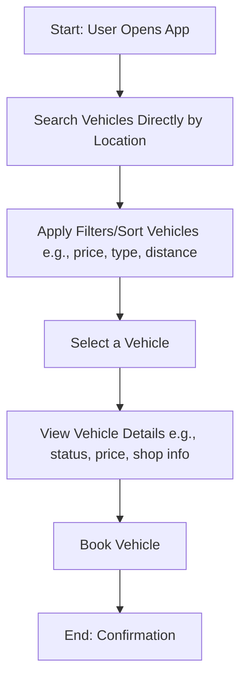

# KendaraGo

[KendaraGo](https://kendarago.com) is a web-based application designed to facilitate vehicle rentals, with a primary focus on motorcycles. The app addresses key user pains such as inaccurate location and contact information, difficulty in comparing and selecting options, unclear availability, and lack of transparent rental details. It aims to provide a seamless experience for users to find, filter, and view rental options quickly, minimizing the need for direct contact with providers.

Table of Contents:

- [Kendara Go](#kendara-go)
  - [Links](#links)
  - [Architecture](#architecture)
    - [Presentation Layer (UI)](#presentation-layer-ui)
    - [Application Layer (Business Logic)](#application-layer-business-logic)
    - [Data Access Layer (Database)](#data-access-layer-database)
  - [Flowchart](#flowchart)
  - [Features](#features)
    - [1. Location-Based Search](#1-location-based-search)
    - [2. Vehicle Filtering & Sorting](#2-vehicle-filtering--sorting)
    - [3. Vehicle & Rental Details](#3-vehicle--rental-details)
  - [UI Designs](#ui-designs)
    - [Home Page](#home-page)
  - [Entity Relationship Diagram (ERD)](#entity-relationship-diagram-erd)
  - [Getting Started](#getting-started)
    - [Installation](#installation)
    - [Development](#development)
  - [Building for Production](#building-for-production)
  - [Deployment](#deployment)
    - [Docker Deployment](#docker-deployment)
    - [DIY Deployment](#diy-deployment)
  - [Styling](#styling)

## Links

- Website/Frontend:
  - Backend:
- Repositories:
  - Backend: <https://github.com/kendarago/kendarago-api>
  - Frontend: <https://github.com/kendarago/kendarago>

Inspirations:

- <https://www.turo.com>
- <https://www.traveloka.com/id-id/car-rental>
- <https://www.kayak.co.id/>

## Architecture

### Presentation Layer (UI)

- HTML
- CSS
  - Tailwind CSS
  - Shadcn/ui
- Javascript
- Typescript
- React
- React Router
- Docker

### Application Layer (Business Logic)

- Javascript
- Typescript
- Hono
- OpenAPI
- Zod
- Docker

### Data Access Layer (Database)

- Prisma
- PostgreSQL
- Docker

## Flowchart



## Features

### 1. Location-Based Search

- Automatic location detection via GPS or manual input (city/district)
- Map integration (Google Maps / Leaflet) showing nearby rentals
- Rental list displays:
  - Distance (km)
  - Full address
  - Phone number / WhatsApp
  - Operating hours
- Fallback: text-based search if GPS is disabled

### 2. Vehicle Filtering & Sorting

- Filter:
  - Vehicle type (focus on Motorcycles: Matic, Underbone, Sport, etc.)
  - Brand (Honda, Yamaha, etc.)
  - Price range per day (slider or manual input)
  - Availability status (Available / Maintenance)
- Sorting:
  - Lowest price → Highest
  - Highest price → Lowest
  - Nearest distance
- Real-time filtering & sorting (without page reload)

### 3. Vehicle & Rental Details

- Detail page per rental / per motorcycle with:
  - Vehicle photos (multiple)
  - Real-time status: Available / Booked / Maintenance
  - Motorcycle type & brand
  - Base price (starting from ... /day)
  - Additional costs:
    - Overtime per hour
    - Delivery / Pick-up (if available)
  - Rental terms & conditions
  - Required documents (ID Card, Driver's License C, etc.)
  - Direct contact button (Phone / WhatsApp)
- Automatic status update via polling or WebSocket (optional in MVP)

## UI Designs

- Figma: <https://www.figma.com/design/g4WZixh4KQUw449yd3IddI/KendaraGo?node-id=22-3&t=ZIrMH33e78VcZfhV-1>

### Home Page


## Entity Relationship Diagram (ERD)

Detailed design: [https://dbdiagram.io/d/6924ddf7228c5bbc1a51f3ee](https://dbdiagram.io/d/6924ddf7228c5bbc1a51f3ee)

# Kendarago

## Getting Started

### Installation

Install the dependencies:

```bash
npm install
```

### Development

Start the development server with HMR:

```bash
npm run dev
```

Your application will be available at `http://localhost:5173`.

## Building for Production

Create a production build:

```bash
npm run build
```

## Deployment

### Docker Deployment

To build and run using Docker:

```bash
docker build -t my-app .

# Run the container
docker run -p 3000:3000 my-app
```

The containerized application can be deployed to any platform that supports Docker, including:

- AWS ECS
- Google Cloud Run
- Azure Container Apps
- Digital Ocean App Platform
- Fly.io
- Railway

### DIY Deployment

If you're familiar with deploying Node applications, the built-in app server is production-ready.

Make sure to deploy the output of `npm run build`

```
├── package.json
├── package-lock.json (or pnpm-lock.yaml, or bun.lockb)
├── build/
│   ├── client/    # Static assets
│   └── server/    # Server-side code
```

## Styling

This template comes with [Tailwind CSS](https://tailwindcss.com/) already configured for a simple default starting experience. You can use whatever CSS framework you prefer.

---

Built with ❤️ using React Router.
