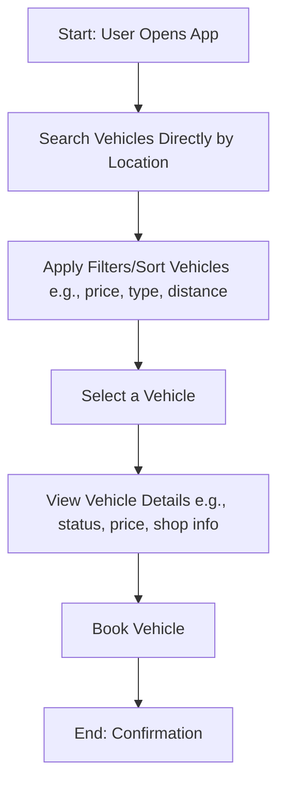

# Kendarago 🚗

### Search, Rent, and Go

**Kendarago** is a vehicle rental platform that helps users search for available vehicles, rent vehicles, and enjoy their trips with ease. Whether you need a car for a family trip, a bike for a solo ride, or any other vehicle, Kendarago ensures a hassle-free experience with ease.

🔍 Why Kendarago?

Traditional rental processes are often frustrating. Kendarago was built to solve specific user pain points by eliminating inaccurate location and contact information, offering clear availability and transparent rental details, simplifying the comparison process, and minimizing the need for direct contact with providers

With Kendarago, users can find, filter, and view rental options instantly—making the journey as enjoyable as the destination.

## 🚀 Features

- 🔍 **Vehicle Search & Discovery** – Find available vehicles based on location and type,.
- 📖 **Detailed Vehicle Information** – View vehicle details, including specifications, pricing, availability, and features.
- 🗺️ **Interactive Map Navigation** – Locate vehicles on an interactive map for easy directions.
- 🔖 **Book Vehicles** – Reserve your chosen vehicle with a simple booking process.

## 🤝 Team

| Full Name                      | Nick  | Telegram          | GitHub                                    | Role       |
| ------------------------------ | ----- | ----------------- | ----------------------------------------- | ---------- |
| Rakhel Cakra Kusumadinata Sera | Cakra | @rakhelcakra      | [view](https://github.com/CakraSera)      | Full Stack |
| Mochamad Irvan                 | Irvan | @xzrvan           | [view](https://github.com/mchmdirvan)     | Full Stack |
| Sia Billal Quba                | Obby  | @siabillalquba    | [view](https://github.com/siabillalquba)  | Full Stack |
| Muhammad Rizki Kurnia Putra    | Nanda | @muhammmadrizki20 | [view](https://github.com/muhammmadrizki) | Full Stack |
| Galuh Wasesa                   | Nanda | @sesha22          | [view](https://github.com/sesha22)        | Frontend   |

## 🔗 Links

- Kendarago Web is live at <https://kendarago.com>
- Kendarago API is at <https://api.kendarago.com>

Repositories:

- Frontend Web: <https://github.com/kendarago/kendarago>
- Backend API: <https://github.com/kendarago/kendarago-api>

## 🔎 Inspirations

- [Turo](https://www.turo.com)
- [Traveloka](https://www.traveloka.com/id-id/car-rental)
- [Kayak](https://www.kayak.co.id/)

## 🎨 UI Designs

Look at [Figma](https://www.figma.com/design/g4WZixh4KQUw449yd3IddI/KendaraGo?node-id=22-3&t=ZIrMH33e78VcZfhV-1)

## ERD

## Flowchart

